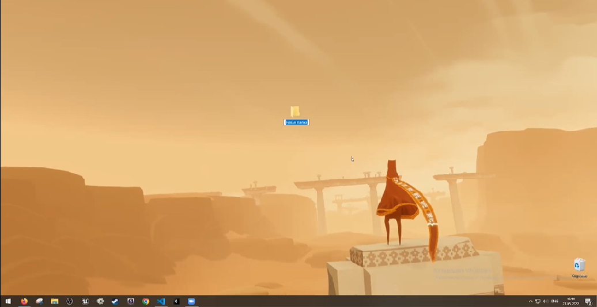
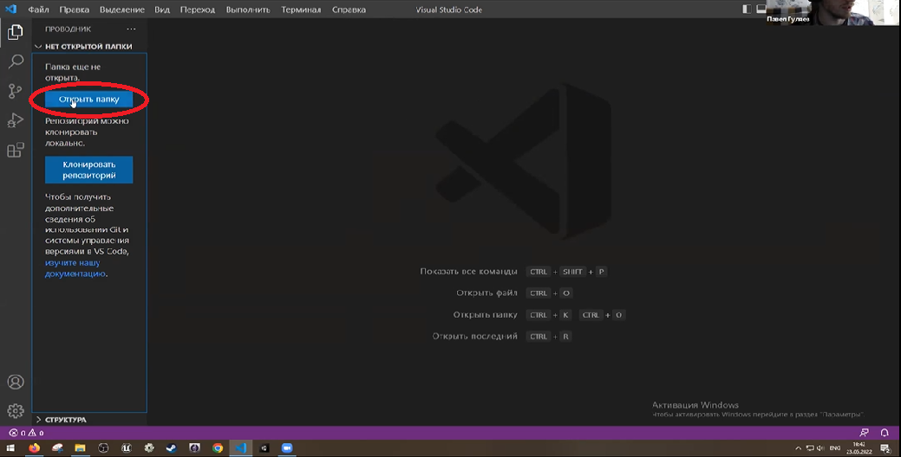
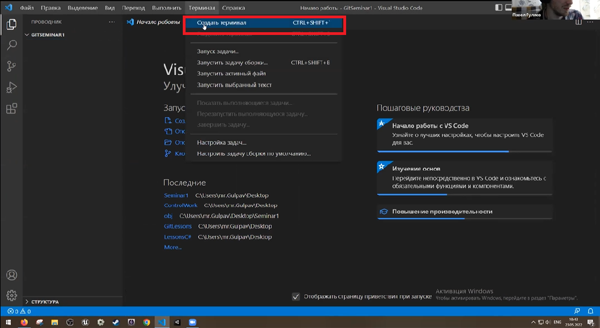
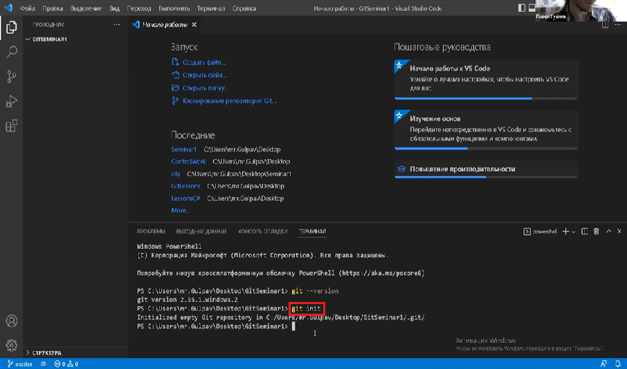
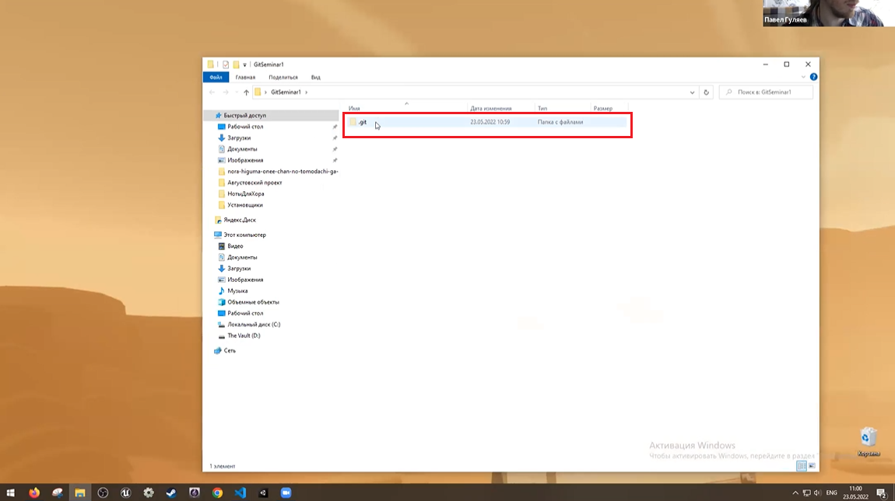
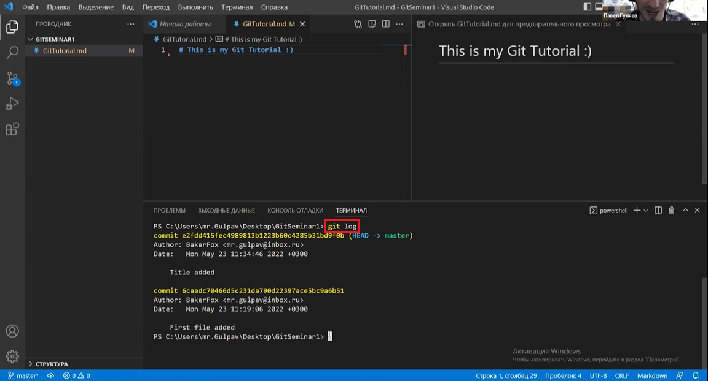
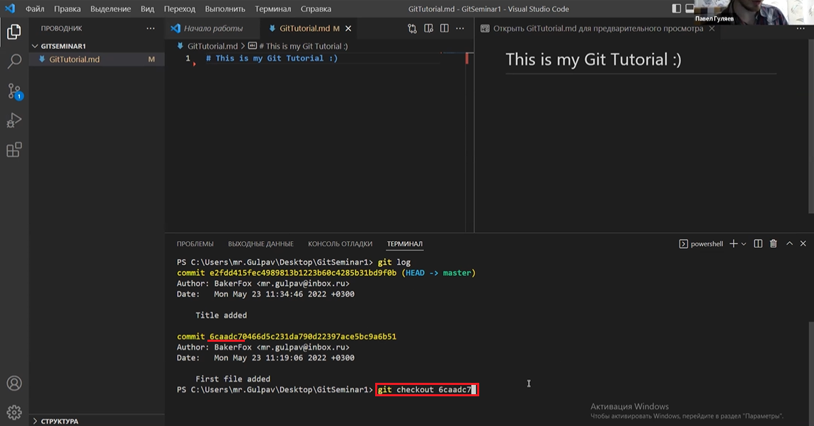

# **Инструкция по работе с Git.**

1. Установите git с официального сайта по инструкции: http://git­scm.com/downloads

2. Настройте git, достаточно только задать имя и email с помощью команд: 
- *git config ­­global user.name "имя пользователя"* 
- *git config ­­global user.email "email пользователя*

3. Создайте репозиторий.
   - Создаем пустую папку на Desktop 

   - Открываем Visual Studio Code и указываем область работы компьютера, выбераем нужную директорию 

   - Открываем терминал  

   - Вызываем команду *"git init"*, инициализируем репозиторий 

   - Открываем рабочую папку на desktop и проверяем наличие папки с название *".git"* - это и есть репозиторий 

4. Создайте файл.
   - Напротив рабочей директории нажимаем на кнопку создать файл .png)

   - Даём имя файлу и нужное расширение

   - Добавляем файл  к списку отслеживаемых файлов с помощью команды *"git add <имя папки с которой работаем*\*>" 
   
   **\*при выборе папки воспользуйтесь кратким вводом с помощью кнопки *"Tab"*.**

   - Совершаем коммит, чтобы зафиксировать файл как часть проекта, для этого обращаемся к команде *"git commit -m"<комментарий к коммиту>""* .png)

4. Вызовите команду *"git log"*, проверьте историю коммитов.
**(Важно: перед тем как обращаться к команде *"git log"*, необходимо сохранить изменения клавишами *"Ctrl+S"* и сделать коммит)**.png)

5. Если необходимо обратиться к определенному коммиту, то вызываем команду *"git checkout <имя нужного коммита>"*, достаточно указать первые несколько символов 

6. Для возврата в последнее состояние, воспользуйтесь командой *"git checkout master"*

____

## Сводка команд:
- *"git config"* - настройка конфигураций.
- *"git add"* - добавление новых элементов.
- *"git commit"* - фиксация элементов.
- *"git status"* - текщий статус.
- *"git log"* - детальная история коммитов.
- *"git init"* - инициализация репозитория.
- *"git checkout"* - проверка/перемещение по коммитам.
- *"git version"* - текущая версия Git.
- *"-m"* - message.
- *"clear"* - очистка видимой части истории терминала.

---

# Seminar 2

* Создание новой ветки и переходы между ветками

1. Для создания новой ветки используется команда *git branch branch_name* - название создаваемой ветки.
2. Для перехода между ветками используется команда *git checkout branch_name*, где *branch_name* - название целевой ветки.

* Слияние веток

1. Для осуществления слияния веток используется команда *git merge Branch_name*, где *branche_name* - название ветки, сливаемой с текущей веткой.

* Конфликты при слиянии, их разрешения

1. Эта строка создана для демонстрации конфликта.

* Итоги семинара